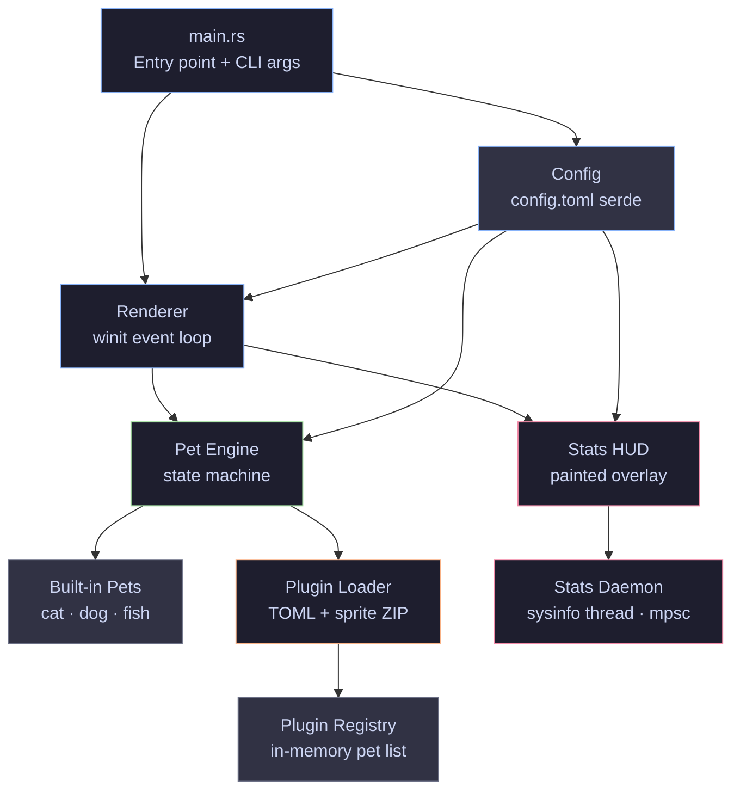
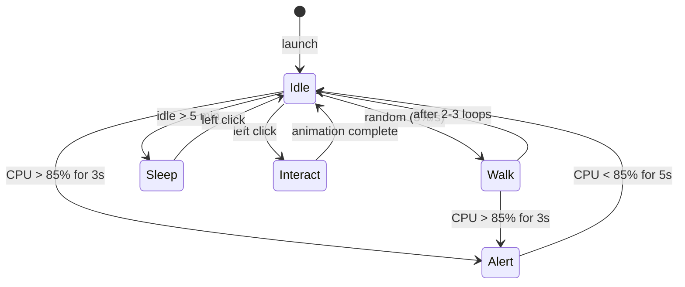
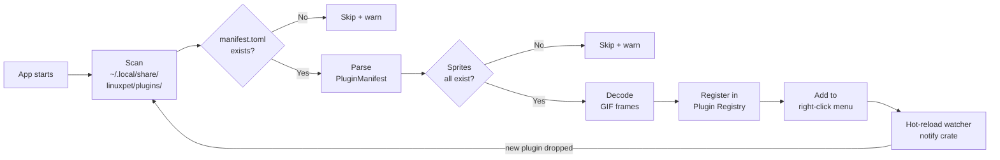
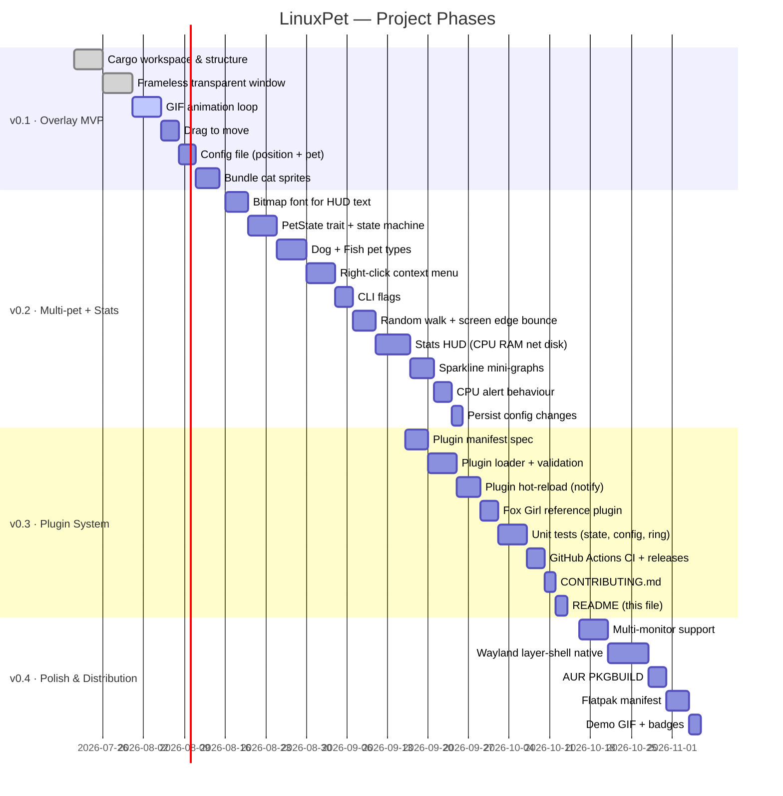

<div align="center">


# 🐾 LinuxPet

**A multi-pet animated Linux desktop companion — written in Rust**

> Cats, dogs, fish and custom plugin sprites floating on your desktop,
> with a live system stats HUD baked right in.

[](https://github.com/KADHIRAVANEG/linuxpet/actions)
[](LICENSE)
[](https://www.rust-lang.org)
[](https://aur.archlinux.org/packages/linuxpet)

[Install](#-installation) · [Usage](#-usage) · [Plugin Authoring](#-plugin-authoring) · [Contributing](#-contributing) · [Roadmap](#-roadmap)

</div>

---

## ✨ Features

- 🐱 **Multiple built-in pets** — Cat, Dog, Fish — switchable at runtime via right-click
- 📊 **Live system stats HUD** — CPU, RAM, network and disk with sparkline history graphs
- 🎨 **Plugin system** — drop in a sprite ZIP to add any custom pet
- ⚡ **Alert behaviour** — pet panics when your CPU hits 85%+
- 🖱️ **Drag to anywhere** — position remembered across restarts, per-monitor
- 🌊 **Wayland + X11** — native layer-shell on Wayland, X11 compositor supported
- 📦 **Single binary** — no runtime dependencies, all sprites embedded at compile time

---

## 🚀 Installation

### Prebuilt binary (fastest)

```bash
curl -L https://github.com/KADHIRAVANEG/linuxpet/releases/latest/download/linuxpet-x86_64 \
  -o ~/.local/bin/linuxpet
chmod +x ~/.local/bin/linuxpet
linuxpet
```

### Arch Linux (AUR)

```bash
yay -S linuxpet
# or
paru -S linuxpet
```

### Flatpak

```bash
flatpak install flathub io.github.KADHIRAVANEG.linuxpet
flatpak run io.github.KADHIRAVANEG.linuxpet
```

### From source

```bash
git clone https://github.com/KADHIRAVANEG/linuxpet
cd linuxpet
cargo build --release
./target/release/linuxpet
```

> **Arch dependencies:** `sudo pacman -S libx11 libxcursor pkg-config`
> **Ubuntu dependencies:** `sudo apt install libx11-dev libxcursor-dev pkg-config`

---

## 🖥️ Usage

```
linuxpet [OPTIONS]

Options:
  --pet <type>       Start with a specific pet: cat | dog | fish | <plugin-name>
  --pos <x> <y>      Set starting screen position
  --no-stats         Disable the stats HUD at launch
  --scale <factor>   Scale the sprite (0.5 – 3.0, default 1.0)
  --debug            Enable verbose logging
  --version          Print version
  --help             Print this help
```

**Right-click the pet** to open the context menu:

```
Switch Pet  ▶  🐱 Cat
               🐶 Dog
               🐟 Fish
               ── plugins ──
               🦊 Fox Girl
Toggle Stats HUD   [on]
Quit
```

**Config file** lives at `~/.config/linuxpet/config.toml` and is created on first run:

```toml
[window]
monitor   = "DP-1"
x         = 1800
y         = 900

[pet]
type       = "cat"
wait_secs  = 5
walk_speed = 1.5

[stats]
enabled       = true
alert_cpu_pct = 85

[scale]
factor = 1.0
```

---

## 📊 Stats HUD

When enabled, a small semi-transparent panel floats next to your pet showing:

```
╭───────────────────────────────────╮
│ CPU  ▁▂▄▆▇▅▃▂▁▂▄▅▆▇▆▅  42%        │
│ RAM  ▄▄▄▄▄▄▄▄▄▄▄▄▄▄▄▄  6.1 / 8 GB │
│ NET  ↓ 1.2 MB/s  ↑ 0.3 MB/s       │
│ DISK ░░░░░░░░░░░░░  idle          │
╰───────────────────────────────────╯
```

Sparklines show the last 60 seconds of history. When CPU exceeds the alert threshold your pet will switch to a panic animation until load drops.

---

## 🎨 Plugin Authoring

Anyone can create and share a custom pet. A plugin is a folder containing a manifest and GIF sprites.

### Directory layout

```
~/.local/share/linuxpet/plugins/
└── mypet/
    ├── manifest.toml
    ├── idle.gif
    ├── walk.gif
    ├── sleep.gif
    └── alert.gif
```

### manifest.toml

```toml
[pet]
name    = "My Pet"
author  = "yourname"
version = "1.0.0"

[sprites]
idle  = "idle.gif"
walk  = "walk.gif"
sleep = "sleep.gif"
alert = "alert.gif"   # optional

[behaviour]
walk_chance  = 0.25   # probability per second of entering Walk state
sleep_after  = 300    # seconds idle before Sleep state
walk_speed   = 1.5    # pixels per frame
```

### Installing a plugin

```bash
# From a ZIP (distributed format)
unzip mypet.zip -d ~/.local/share/linuxpet/plugins/

# Plugin appears in the right-click menu immediately — no restart needed
```

See [`docs/plugin-spec.md`](docs/plugin-spec.md) for the full specification. The [`plugins/foxgirl/`](plugins/foxgirl/) folder is a working reference implementation.

---

## 🏗️ Architecture



---

## 🤖 Pet State Machine



---

## 🔌 Plugin Load Flow



---

## 🗺️ Roadmap



---

## 📁 Project Structure

```
linuxpet/
├── src/
│   ├── main.rs          # Entry point, CLI arg parsing (clap)
│   ├── renderer.rs      # winit event loop, softbuffer, tiny-skia blit
│   ├── font.rs          # fontdue bitmap text renderer helper
│   ├── config.rs        # serde config struct, read/write config.toml
│   ├── stats.rs         # sysinfo polling thread, RingBuffer, StatsSnapshot
│   ├── plugin.rs        # plugin discovery, manifest parsing, hot-reload watcher
│   └── pet/
│       ├── mod.rs       # Pet trait, PetState enum, StateMachine
│       ├── cat.rs       # Cat — built-in sprites + behaviour
│       ├── dog.rs       # Dog — built-in sprites + behaviour
│       └── fish.rs      # Fish — sine-wave drift, no walk state
├── assets/
│   ├── cat/             # idle.gif  walk.gif  sleep.gif  alert.gif
│   ├── dog/             # idle.gif  walk.gif  sleep.gif  alert.gif
│   └── fish/            # idle.gif  swim.gif
├── plugins/
│   └── foxgirl/         # reference community plugin
│       ├── manifest.toml
│       ├── idle.gif
│       ├── walk.gif
│       └── sleep.gif
├── docs/
│   └── plugin-spec.md   # full plugin authoring specification
├── packaging/
│   ├── aur/             # PKGBUILD for Arch Linux AUR
│   └── flatpak/         # Flatpak manifest
├── .github/
│   └── workflows/
│       ├── ci.yml       # check + clippy + test on every PR
│       └── release.yml  # build binaries on tag push
├── Cargo.toml
├── CONTRIBUTING.md
├── CHANGELOG.md
└── README.md
```

## Chart 

```mermaid
graph TD
    %% Styling
    classDef folder fill:#2374ab,stroke:#1d6391,stroke-width:2px,color:#fff;
    classDef file fill:#f7f7f7,stroke:#ccc,stroke-width:1px,color:#333;
    
    %% Root
    root[linuxpet/]:::folder

    %% Level 1
    src[src/]:::folder
    assets[assets/]:::folder
    plugins[plugins/]:::folder
    docs[docs/]:::folder
    packaging[packaging/]:::folder
    github[.github/]:::folder
    cargo[Cargo.toml]:::file
    contrib[CONTRIBUTING.md]:::file
    changelog[CHANGELOG.md]:::file
    readme[README.md]:::file

    root --> src
    root --> assets
    root --> plugins
    root --> docs
    root --> packaging
    root --> github
    root --> cargo
    root --> contrib
    root --> changelog
    root --> readme

    %% Src Subtree
    main[main.rs<br/><i>CLI & Entry</i>]:::file
    renderer[renderer.rs<br/><i>winit/softbuffer</i>]:::file
    font[font.rs<br/><i>fontdue bitmap</i>]:::file
    config[config.rs<br/><i>serde config.toml</i>]:::file
    stats[stats.rs<br/><i>sysinfo polling</i>]:::file
    plugin[plugin.rs<br/><i>hot-reload watcher</i>]:::file
    pet_dir[pet/]:::folder

    src --> main
    src --> renderer
    src --> font
    src --> config
    src --> stats
    src --> plugin
    src --> pet_dir

    %% Pet Subtree
    pet_mod[mod.rs<br/><i>Pet Trait & SM</i>]:::file
    pet_cat[cat.rs<br/><i>Cat behavior</i>]:::file
    pet_dog[dog.rs<br/><i>Dog behavior</i>]:::file
    pet_fish[fish.rs<br/><i>Fish behavior</i>]:::file

    pet_dir --> pet_mod
    pet_dir --> pet_cat
    pet_dir --> pet_dog
    pet_dir --> pet_fish

    %% Assets Subtree
    a_cat[cat/]:::folder
    a_dog[dog/]:::folder
    a_fish[fish/]:::folder

    assets --> a_cat
    assets --> a_dog
    assets --> a_fish

    %% Plugins Subtree
    p_fox[foxgirl/]:::folder
    p_man[manifest.toml]:::file
    
    plugins --> p_fox
    p_fox --> p_man

    %% Docs Subtree
    d_spec[plugin-spec.md]:::file
    docs --> d_spec

    %% Packaging Subtree
    pkg_aur[aur/]:::folder
    pkg_flat[flatpak/]:::folder
    packaging --> pkg_aur
    packaging --> pkg_flat

    %% Github Subtree
    gh_wf[workflows/]:::folder
    github --> gh_wf
```



---

## 🛠️ Tech Stack

| Layer | Crate | Why |
|---|---|---|
| Windowing | `winit 0.30` | Cross-platform window + input events |
| Pixel buffer | `softbuffer 0.4` | Zero-copy framebuffer without GPU requirement |
| 2D rendering | `tiny-skia 0.11` | Pure Rust rasteriser, no system deps |
| Font | `fontdue 0.9` | Embedded TTF rasteriser, pure Rust |
| GIF decode | `image 0.25` + gif feature | Frame-by-frame RGBA decode with delay metadata |
| System stats | `sysinfo 0.30` | CPU, RAM, network, disk — cross-platform |
| Config | `serde` + `toml 0.8` | Type-safe TOML config with derive macros |
| CLI | `clap 4` | Derive-based argument parser |
| File watch | `notify 6` | Plugin hot-reload via inotify/kqueue |
| Logging | `log` + `env_logger` | `RUST_LOG=debug linuxpet` for verbose output |

---

## 🤝 Contributing

Contributions are welcome — bug reports, new pet sprites, plugin packs, or code.

See [CONTRIBUTING.md](CONTRIBUTING.md) for the full dev setup guide.

Quick start:

```bash
git clone https://github.com/KADHIRAVANEG/linuxpet
cd linuxpet
cargo build       # compile
cargo test        # run tests
cargo clippy      # lint
cargo run         # launch
```

---

## 📜 License

MIT — see [LICENSE](LICENSE).

---

<div align="center">
Made with 🦀 Rust · Built on Arch Linux · Open source forever
</div>
